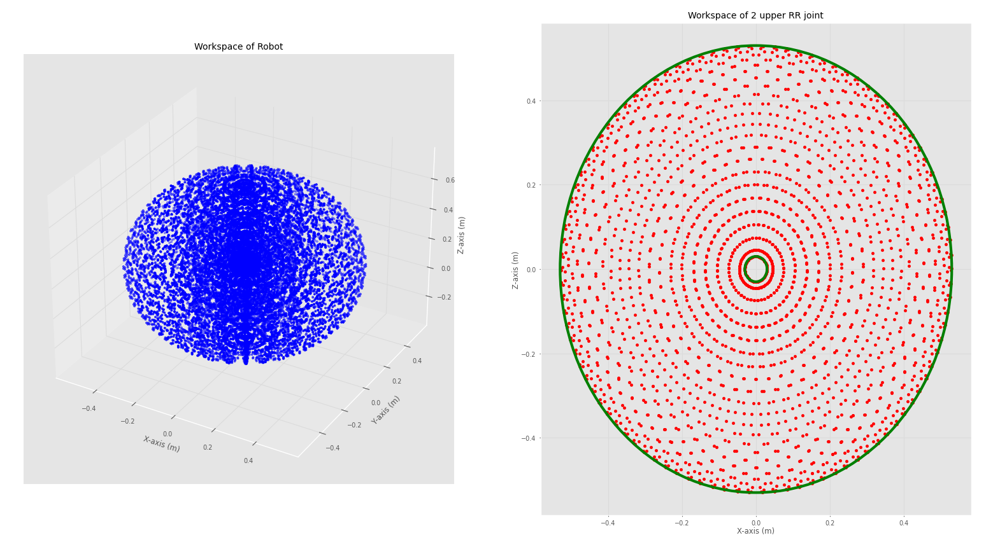

# fun4

## ขั้นตอนการ run
1. clone repository ไว้ที่ home
```sh
cd ~
git clone https://github.com/Ling-ling00/fun4.git
```
2. colcon build ที่ path ~/fun4
```sh
cd ~/fun4
colcon build
```
3. เปิด .bashrc file แล้วเพิ่ม command source ~/fun4/install/setup.bash ที่บรรทัดสุดท้าย (แล้วเปิด terminal ใหม่)
```sh
cd ~
gedit .bashrc
```
หรือ run คำสั่งทุกครั้งที่เปิด terminal ใหม่
```sh
source ~/fun4/install/setup.bash
```
4. run launch file ของหุ่นด้วย
```sh
ros2 launch fun4 robot_display.launch.py
```
5. run teleop key สำหรับควบคุมใน mode 2 ด้วย
```sh
ros2 run fun4 robotteleop_key.py
```
## การทำงาน
### Part 1: Setup Environment
##### หา workspace ของแขนกลพร้อมวิธีการตรวจสอบคําตอบ
```sh
python3 ~/fun4/src/fun4/scripts/workspace.py
```

จากรูปด้านซ้ายแสดงให้เห็น wrokspace ทั้งหมดของหุ่น และด้านขวาแสดงให้เห็น workspace ของ joint 2 และ 3 (วงกลมสีเขียวมีขนาด 0.03 m  และ 0.53 m)โดยหากนำรูปด้านขวาหมุนรอบแกน x=0 แล้วเลื่อนขึ้นตามแนวแกน z 0.2 m จะได้รูปทางซ้าย

สรุปได้ว่าหุ่นมี workspace อยู่ภายในทรงกลมขนาด 0.53 m ที่มีจุดศูนย์กลางอยู่ที่ x,y,z = 0, 0, 0.2 m แต่อยู่ภายนอกทรงกลมขนาด 0.03 m ที่มีจุดศูนย์กลางอยู่ที่ x,y,z = 0, 0, 0.2 m


##### target and end-effector position
หลังจาก run node ทั้งหมด การสุ่มจะทำงานด้วยคำสั่ง 
```sh
ros2 service call /mode robot_interfaces/srv/Robot 'mode: 3
taskspace:
  x: 0.0
  y: 0.0
  z: 0.0'
```
โดย node /target_random จะทำการสุ่มค่าและส่งให้ node /robot_control หลังจากนั้น node /robot_control จะส่งค่าที่ได้จากการสุ่ม และตำแหน่งของ end-effector ให้ rviz ผ่าน topic /target และ /end_effector

### Part 2: Controller
ในส่วนการควบคุมแขนกล จะสามารถควบคุมได้ผ่าน service /mode โดยเป็น custom service ประเภท robot_interfaces/srv/Robot ประกอบไปด้วย

- Request
    - int64 mode : สำหรับเลือก mode (1,2,3 หากใส่เลขอื่นจะไม่ทำงาน)
    - geometry_msgs/Point taskspace : สำหรับใส่ตำแหน่งเป้าหมายใน mode 1 โดยจะไม่มีผล mode 2 และ 3
- Response
    - bool mode : แสดงผลว่าเปลี่ยน mode สำเร็จหรือไม่
    - bool start : แสดงผลว่า mode นั้นๆเริ่มทำงานได้หรือไม่
    - float64 q1 : แสดงผลมุมเป้าหมายของ q1 ใน mode 1 และมุม q1 ในปัจจุบันใน mode อื่นๆ
    - float64 q2 : แสดงผลมุมเป้าหมายของ q2 ใน mode 1 และมุม q2 ในปัจจุบันใน mode อื่นๆ
    - float64 q3 : แสดงผลมุมเป้าหมายของ q3 ใน mode 1 และมุม q3 ในปัจจุบันใน mode อื่นๆ

##### mode 1 Inverse Pose Kinematics (IPK)
สามารถสั่งการด้วยคำสั่ง โดยเปลี่ยนค่าเป้าหมายที่ต้องการในตัวแปร taskapace
```sh
ros2 service call /mode robot_interfaces/srv/Robot 'mode: 1
taskspace:
  x: 0.0
  y: 0.0
  z: 0.0'
```
- หากเปลี่ยน mode สำเร็จ respone mode จะเป็น True
- หากพบคําตอบ response start จะเป็น True และ response q1, q2, q3 จะเป็น solution ของ configuration ของแขนกล หลังจากนั้นแขนกลจะเคลื่อนที่ตาม solution ที่คํานวนออกมา
- หากไม่พบคําตอบ response start จะเป็น False และแขนกลจะอยู่ที่ตําแหน่งเดิม

##### mode 2 Teleoperation
สามารถสั่งการด้วยคำสั่ง 
```sh
ros2 service call /mode robot_interfaces/srv/Robot 'mode: 2
taskspace:
  x: 0.0
  y: 0.0
  z: 0.0'
```
mode 2 จะถูกควบคุมด้วย keyboard ผ่าน node /teleop_key_node สามารถ run ได้ด้วยคำสั่ง
```sh
ros2 run fun4 robotteleop_key.py
```
โดย สามารถควบคุมได้ ดังนี้
- q : move forward in x axis
- a : move backward in x axis
- w : move forward in y axis
- s : move backward in y axis
- e : move forward in z axis
- d : move backward in z axis
- x : stop
- u : decrease speed
- i : increase speed
- o : change reference to base
- p : change reference to end effector
- z : exit

หากหุ่นเข้าใกล้สภาวะ Singularity หุ่นจะหยุดทำงาน และ publish topic ออกมาแจ้งเตือนผ่าน topic /singularity
```sh
ros2 topic echo /singularity
```

##### mode 3 Auto
สามารถสั่งการด้วยคำสั่ง 
```sh
ros2 service call /mode robot_interfaces/srv/Robot 'mode: 3
taskspace:
  x: 0.0
  y: 0.0
  z: 0.0'
```
node /target_random จะทำการสุ่มค่าและส่งให้ node /robot_control เพื่อเคลื่อนที่ไปยังตำแหน่งเป้าหมาย โดยหากเคลื่อนถึงเป้าหมายภายในเวลา 10 วินาที จะทำการส่ง response กลับไปที่ node /target_random เพื่อ random เป้าหมายใหม่ หากไม่ถึงภายใน 10 วินาทีจะหยุดทำงาน